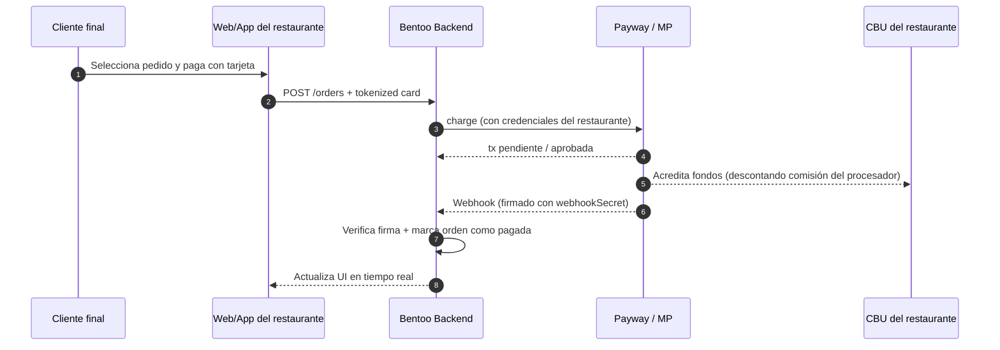

# Modelo de pagos descentralizado (no-custodial)

Este documento describe la arquitectura del módulo de pagos de Bentoo: cómo cobra
cada restaurante, qué datos guarda la plataforma, cuáles son los flujos de
crédito y reconciliación, y qué responsabilidades quedan de cada lado.

## 1. Filosofía

Bentoo **no custodia dinero**. Cada restaurante usa **su propia cuenta de
comerciante** en cada proveedor de pagos (Payway / Decidir, MercadoPago) y los
fondos se acreditan directamente en el **CBU/CVU** que el comerciante haya
configurado en su contrato con el procesador.

La plataforma:

- Almacena credenciales del comerciante cifradas con AES-256-GCM.
- Inicia el cobro en nombre del comerciante (server-to-server) usando esas
  credenciales.
- Recibe webhooks de los proveedores y actualiza el estado del pedido /
  suscripción.
- Reconcilia periódicamente contra la API del proveedor por si algún webhook se
  perdió.

La plataforma **no** recibe dinero, **no** redistribuye fondos y **no** cobra
comisiones por transacción. La comisión SaaS se cobra aparte vía la suscripción
mensual del restaurante.

## 2. Modelo de datos

### `PaymentProviderCredential`

Guarda credenciales por restaurante y por proveedor (`payway` por ahora; otros
en el futuro).

| Campo                 | Tipo          | Notas                                                               |
| --------------------- | ------------- | ------------------------------------------------------------------- |
| `restaurantId`        | `String`      | FK; único por `(restaurantId, provider)`.                           |
| `provider`            | `String`      | `'payway'`.                                                         |
| `isSandbox`           | `Boolean`     |                                                                     |
| `secretKeyCipher`     | `String`      | AES-256-GCM(`private_api_key`).                                     |
| `publicKey`           | `String?`     | `public_api_key` (no es secreta).                                   |
| `siteId`              | `String?`     |                                                                     |
| `merchantId`          | `String?`     |                                                                     |
| `webhookSecretCipher` | `String?`     | AES-256-GCM(secret de 64 chars hex generado por el backend).        |
| `webhookSecretLast4`  | `String?`     | Últimos 4 chars para mostrar en la UI sin descifrar.                |
| `lastTestedAt`        | `DateTime?`   | Última prueba `POST /credentials/:provider/test`.                   |
| `lastTestStatus`      | `'ok'\|'failed'\|null` | Resultado del último test.                                 |
| `lastTestError`       | `String?`     | Mensaje del último error.                                           |
| `isActive`            | `Boolean`     | Toggle manual.                                                      |

### `MercadoPagoCredential`

Tabla legacy específica de MercadoPago. Mismo concepto (`accessTokenCiphertext`
cifrado) pero con su propio flujo OAuth.

## 3. Endpoints

Todos protegidos por `JwtAuthGuard` + `VerifyRestaurantAccess`.

### Credenciales

| Método | Path                                                       | Descripción                                                                                       |
| ------ | ---------------------------------------------------------- | ------------------------------------------------------------------------------------------------- |
| `GET`  | `/payment-providers/credentials`                           | Lista credenciales del restaurante (con `webhookSecretLast4`, `lastTestStatus`, `lastTestedAt`).  |
| `POST` | `/payment-providers/credentials/:provider`                 | Upsert. La primera vez que se crea Payway, devuelve `webhookSecretReveal` (one-shot).             |
| `POST` | `/payment-providers/credentials/:provider/test`            | Llama al proveedor con las credenciales guardadas y persiste `lastTestStatus`.                    |
| `POST` | `/payment-providers/credentials/:provider/rotate-webhook-secret` | Regenera el secret y devuelve el nuevo plaintext (one-shot).                                |
| `DELETE` | `/payment-providers/credentials/:provider`               | Borra la credencial.                                                                              |

#### Reveal one-shot

El `webhookSecret` se genera con `crypto.randomBytes(32).toString('hex')` (64
chars hex) y se cifra inmediatamente. El plaintext **solo se devuelve una vez**,
en la respuesta del upsert o del rotate. La UI muestra un banner "Copialo ahora"
y deja al dueño pegarlo en el panel del proveedor. Si el dueño lo pierde, debe
**rotarlo** desde Settings.

### Webhooks

| Método | Path                          | Descripción                                                            |
| ------ | ----------------------------- | ---------------------------------------------------------------------- |
| `POST` | `/api/webhooks/payway`        | Recibe notificaciones de Payway. Verifica firma HMAC con el `webhookSecret` descifrado de la credencial activa del restaurante. |

La verificación intenta primero el secret per-tenant; si no existe (legacy),
cae al env `PAYWAY_WEBHOOK_SECRET` global. Esto facilita la migración.

## 4. Reconciliación

`PaymentReconciliationService` (cron cada 5 min) consulta la API del proveedor
para todas las órdenes con estado `pending` o `processing` creadas en las
últimas 24 h y reconcilia el estado. Esto cubre el caso en que un webhook se
pierda (timeout, error temporal, etc.).

## 5. Cifrado

`EncryptionService` usa AES-256-GCM con key `PAYMENT_ENCRYPTION_KEY` (32 bytes
en hex). Formato del ciphertext: `iv.tag.ciphertext` en base64. Si la key no
está seteada en producción el servicio refuse a arrancar.

## 6. Onboarding y publicación

`POST /restaurants/:id/complete-onboarding` valida que exista al menos un
proveedor activo con `lastTestStatus='ok'` (Payway) o un `accessTokenCiphertext`
(MercadoPago). Si no, devuelve `400` con `code: 'PAYMENT_PROVIDER_REQUIRED'`.
La UI debe redirigir al paso de Pagos cuando recibe ese código.

## 7. Responsabilidades

| Bentoo (SaaS)                                              | Restaurante (dueño)                                                  |
| ---------------------------------------------------------- | -------------------------------------------------------------------- |
| Almacenar credenciales cifradas.                           | Abrir y mantener la cuenta de comerciante en Payway/MP.              |
| Iniciar cobros, reconciliar, verificar webhooks.           | Configurar el CBU/CVU donde se acreditan los fondos.                 |
| Mostrar estado, reportes y exportes contables al dueño.    | Cumplir con ARCA, retenciones y emisión de comprobantes.             |
| Cobrar la suscripción SaaS mensual aparte (no por orden).  | Resolver contracargos y atención al cliente final del pago.          |

## 8. Variables de entorno relevantes

| Var                          | Uso                                                            |
| ---------------------------- | -------------------------------------------------------------- |
| `PAYMENT_ENCRYPTION_KEY`     | Key AES-256-GCM (hex 64 chars).                                |
| `PAYWAY_WEBHOOK_SECRET`      | Fallback global de firma de webhooks (legacy / desarrollo).    |
| `PAYWAY_BASE_URL`            | Endpoint del proveedor (sandbox vs prod).                      |

> El secret real para producción es **por restaurante**, no la env global.
